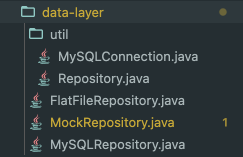
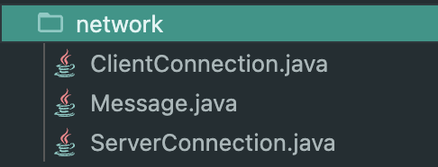
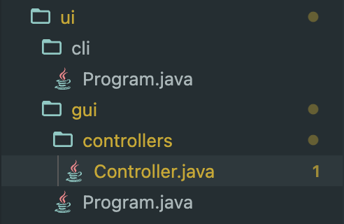
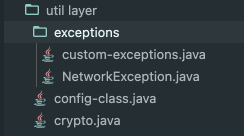
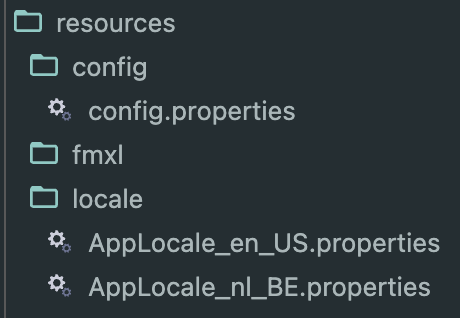

# Object Oriented Architectures and Secure Development (OOASD) Summary - Made by: Elvis Los

If you just downloaded the zip file make sure the links to different documents work! (it's really usefull and saves a lot of time once it works).

I would suggest to not rename any files otherwise the document navigation won't work properly anymore, except if you know what you're doing. You do need to check if the all urls and documents are still up to date.

Make sure you have installed an extension for watching pdf's (vscode example: vscode-pdf).

Goodluck on the examn.

## Links

- [Link to gitlab repo](https://gitlab.ti.howest.be/ti/2023-2024/s3/object-oriented-architectures-and-secure-development)
- [Link to Panopto videos](https://howest.cloud.panopto.eu/Panopto/Pages/Sessions/List.aspx?embedded=0&isFromTeams=false#folderID=%22cd679ef0-0116-46f7-91ff-b06100d69d3a%22)

## Table of Contents - Navigate

### Lessons

- [Week 1 Recap OOP](/OOA-2023-2024/Week%201%20Recap%20OOP/Week%201%20Recap%20OOP.md)
- [Week 2 File-IO](/OOA-2023-2024/Week%202%20File-IO%20/Week%202%20File-IO.md)
- [Week 3 JavaFX](/OOA-2023-2024/Week%203%20JavaFX%20/Week3JavaFX.md)
- [Week 4 Custom Exceptions, JDBC & Configuration files](/OOA-2023-2024/Week%204%20Custom%20Exceptions,%20JDBC%20&%20Configuration%20files/Week%204%20Custom%20Exceptions%20&%20JDBC%20&%20Configuration%20files.md)
- [Week 5 Client - Server](/OOA-2023-2024/Week%205%20Client-Server/Week%205%20Client-Server.md)
- [Week 7 Java File Structure (ntiermodel)](</OOA-2023-2024/Week%207%20Java%20file%20structure%20(ntiermodels)/ntiermodels.md>)
- [Week 8 Stategy Pattern (not for exan)](</OOA-2023-2024/Week%208%20Strategy%20pattern%20(not%20for%20exam)%20/Week%208%20Strategy%20pattern%20(not%20for%20exam).md>)

### Database Layers

- [Data Layer](#data-layer)
- [Domain Layer](#domain-layer)
- [Network Layer](#network-layer)
- [Service Layer](#service-layer)
- [UI Layer](#ui-layer)
- [Util Layer](#util-layer)

### Other Packages

- [Resources](#resources)
- [Test](#test)

### Exam preparation

- [Mock exam 2024 - Assignement](/EX-1-mockexam-2024/Assignment-Mock.pdf)
- [Resit exam 2024 - Assignement](/EX-1-resitexam-2023/Assignment%20EN.pdf)
- [Week 99 Exam Preparation](/OOA-2023-2024/Week%2099%20Exam%20preparation/Exam%20preparation.md)

---

## Data layer

[BACK TO NAVIGATION](#table-of-contents---navigate)

- is responsible for the communication with the data source (MySQL, server, file, …)
- contains the repositories for data you are going to store persistently
- contains the mock repositories

### Files in data layer

In this layer you will have the different repositories you use for your application. It could be a repository for the users, a repository for the products, a repository for the orders, …

It could also be a different type of repository like a FlatFileRepository (plain text), a MySQLRepository, a MongoDBRepository, …

You will also have a util package in this layer. This package will contain the following classes:

- **`Repository` interface class**: This is the interface that will be used by the service layer to access the repositories and will not know anything about the implementation of the repositories. This is a good practice because it allows you to change the implementation of the repositories without affecting the service layer. For example if you change the database from MySQL to MongoDB, you will only need to change the implementation of the repositories and not the service layer.
- **`MySQLConnection` class**: This class is responsible for the connection with the database. It contains the connection string, username and password. It also contains the method to get the connection. This method will be used by the repositories to get the connection with the database.

### Database & Database connection

When creating the database you need to make sure the new user has the right permissions to the database and as minimal as possible.

To link your application to the database you need to add the right dependencies to your build file and create a connection. This connection will be used by the repositories to execute queries on the database.

1.  Add dependencies to `build.gradle.kts` file

    - [build.gradle.kts](/OOA-code-snippets/build/build-gradle.javaFX.java)

2.  Create a Connection instance (**try-with-resources-block**)

    - [MySQLConnection Class](OOA-code-snippets/data-layer/util/MySQLConnection.java)

3.  Execute a query
    - Select statement with(out) parameters [select-query ](/OOA-code-snippets/other/execute-select-stmt.java)
    - Insert statement [INSERT-query](/OOA-code-snippets/other/execute-insert-stmt.java) > **IMPORTANT!!**

**Note**: _Never store the connection url, username & password in the mysqlConnection class, but store them in the resources in a **`.properties`** file._

## Domain layer

[BACK TO NAVIGATION](#table-of-contents---navigate)

This layer contains the classes where the program is about. It contains the classes that represent the entities from the datasource. These classes are called POJO’s (Plain Old Java Objects).

## Network layer

[BACK TO NAVIGATION](#table-of-contents---navigate)

This layer is not always present in an application. It is only present when you have a client-server application. This layer is responsible for the communication between the client and the server.

## Service layer

[BACK TO NAVIGATION](#table-of-contents---navigate)

This layer is responsible for the communication between the UI layer and the data layer. It does all the logic that is not UI related (e.g. authentication method, creating products, ... ). It uses the repositories from the data layer to get the data from the datasource and returns the data to the UI layer.

**Note**: _Make sure each method in a service class returns an unmodifiable result, otherwhise it's not securely designed_

## UI layer

[BACK TO NAVIGATION](#table-of-contents---navigate)

> Split into 2 layers:

1. CLI layer -> Main.java
   - Make sure domain layer classes work in cli first
2. GUI layer -> Program.java
   - Has method to start FXML
   - Extends application
   - has a directory for the **controllers**

### Controllers

**Controllers** are the connection between FXML files in the resources & the java code

Setup controller class:

1. Add the elements which have a **`FX:id`** in the FXML file as **fields** in the controller class
2. Add the elements which have **`OnAction:"#<SOME_NAME>"`** from the FXML file as methods in the controller class
3. Instead of keeping these fields & methods public, which is not secure architecture
   - change the **`public`** to **`@FXML private`**
4. If you need certain fields filled in when starting up the application
   - Create **`Initialize`** method
   - Add **`@FXML`** before the method
5. Initialize the service in the controller class
   - `private static final <NAME_OF_SERVICE_CLASS> service = new <NAME_OF_SERVICE_CLASS>();`
6. Start creating methods

## Util layer

[BACK TO NAVIGATION](#table-of-contents---navigate)

- Contains all utility classes
- Can be for exceptions, config, encryption/decryption, ...

### Custom exceptions

- Custom exceptions are needed so you can show the user specifically what's he doing wrong & specify it for your application
- Custom exception class **ALWAYS** have to `extends RuntimeException`
- Check examples here:
  - [Custom exception file](/OOA-code-snippets/util%20layer/exceptions/custom-exceptions.java)
  - [Network exception file](/OOA-code-snippets/util%20layer/exceptions/NetworkException.java)

### Config utility class

- This file loads, reads & writes the the configurations for the application (eg. `.properties files`, ...)

Example: [Config class](/OOA-code-snippets/util%20layer/config-class.java)

### Crypto utility class

- Need to add to build.gradle file, add to the dependencies block:
- `implementation 'org.springframework.security:spring-security-crypto:6.1.4'`

Example: [crypto.java file](/OOA-code-snippets/util%20layer/crypto.java)

## Resources Package

[BACK TO NAVIGATION](#table-of-contents---navigate)

### Config properties file

Here you will have all the configuration files for your application. These files will be used by the util layer to get the configuration for your application. You can create these files manually or you can create them with the Config class.

- [Config file](/OOA-code-snippets/resources/config/config.properties)

### FXML files

Here you will have all the FXML files for your application. These files will be used by the UI layer to create the user interface. You can create these files manually or you can create them with SceneBuilder.

### Locale files

Here you will store the diffent languages for your application. You can create these files manually or you can create them with the Locale class.

Here are some examples:

- [Locale EN](/OOA-code-snippets/resources/locale/AppLocale_en_US.properties)
- [Locale NL](/OOA-code-snippets/resources/locale/AppLocale_nl_BE.properties)

## Test Package

Here are some examples:

- [Sample Tests](/OOA-code-snippets/test-layer/unit-tests.java)
